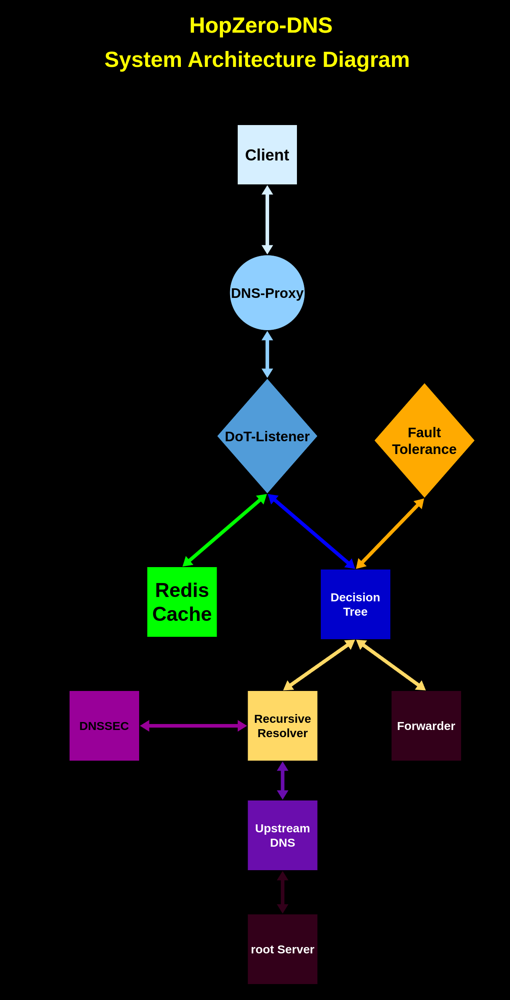

# 🛡️ HopZero-DNS

> **Zero-hop. Zero-trust. Ultra-resilient DNS for the modern internet.**

---

## 🔥 Why HopZero-DNS?

Traditional DNS resolvers are stuck in the past — slow, opaque, and architected for a trust model that no longer exists. **HopZeroDNS** is a next-gen recursive DNS resolver purpose-built for today's threat landscape, with **performance, traceability, and cryptographic assurance** as its core principles.

We've walked in the shoes of sysadmins, red teamers, and devs — and we know the frustration of battling bloated `.conf` files, clunky logs, and unreliable recursion. **HopZeroDNS ships with built-in defaults**, so you can deploy confidently in seconds, not hours.

---

## 🧬 What Makes HopZero-DNS Different?

| Feature                  | HopZero-DNS    | Traditional DNS Resolvers |
| ------------------------ | ------------- | ------------------------- |
| DNS-over-TLS/DoH Support | ✅ Built-in    | ⚠️ Plugin-based/Optional  |
| Recursive Resolution     | ✅ Hardened    | ✅ Yes                     |
| Zero-Hop Mode            | ✅ Native      | ❌ Not supported           |
| Redis Caching Layer      | ✅ Integrated  | ⚠️ External               |
| Full Modular Design      | ✅ Yes         | ❌ Monolithic              |
| Systemd Integration      | ✅ Native      | ⚠️ Requires scripting     |
| Secure Config Reload     | ✅ Graceful    | ❌ Requires restart        |
| Built-in Defaults        | ✅ Plug & Play | ❌ Manual config required  |

---

## 🛠️ Key Features

* 🔐 **Secure Resolution** – Native DNS-over-TLS with optional SSL.
* 🧹 **Modular by Design** – Plug-and-play architecture for components.
* 🚀 **Lightning Fast** – Integrated Redis caching for millisecond responses.
* 🔍 **Auditable by Default** – Structured logs, full traceability.
* 🧠 **Smart Recursion** – Optimized for TTL, fallback, and domain health.
* ⚙️ **Zero-Config Boot** – Works out of the box with sane defaults.
* 💼 **Production-Ready** – systemd, logging, ACLs, and reload-on-change.
* 💼 **Decision tree** – Built-in smart decision making algorithm to smartly choose between forwarder or recursive resolver.

---

## 🏗️ System Architecture



*Figure 1:* **HopZero-DNS System Architecture Diagram.** The diagram illustrates the DNS resolution pipeline from client to root servers, incorporating caching and secure resolution components.  
**Note:** Component color intensity represents criticality — **lighter = non-critical**, **darker = highly critical**.

---

## 📦 Project Layout

```text
HopZero-DNS/
├── app.go                   # Main application entry point
├── DHopZero.service         # systemd service definition
├── Readme.md                # You're reading it
├── gitignore                # Files excluded from version control
├── go.mod                   # Go module metadata
├── go.sum                   # Go module dependency hashes

├── Confs/                   # DNS/root-level resolver config
│   └── root.conf

├── Design/                  # System diagrams and technical drawings
│   ├── System-Architecture.drawio.png
│   └── Data-Flow-Diagram.drawio.png

├── Modules/                 # Core components
│   ├── Config/              # Configuration parser
│   │   └── Config.yaml
│   ├── DoT/                 # DNS-over-TLS implementation
│   │   └── dot.go
│   ├── Loader/              # Dynamic module loader
│   │   └── loader.go
│   ├── Logger/              # Logging handler
│   │   └── logger.go
│   ├── Proxy/               # DNS proxy handler
│   │   └── proxy.go
│   ├── Redis/               # Redis cache connector
│   │   └── redis.go
│   ├── Resolver/            # Custom recursive DNS resolver
│   │   └── recursive.go
│   └── SSL/                 # SSL certificates and keys
│       ├── localhost.pem
│       └── localhost-key.pem
```

---

## 🚀 Quick Start

```bash
# Clone the repo
git clone https://github.com/official-biswadeb941/HopZero-DNS
cd HopZero-DNS

# Install the systemd service
sudo cp DHopZero.service /etc/systemd/system/
sudo systemctl enable DHopZero.service
sudo systemctl start DHopZero.service
```

> HopZero-DNS should now be live and resolving. 🔥

---

## 🧙 For Developers

* **Language:** Go `1.20+`
* **Transport:** TLS, DoT
* **Caching:** Redis (local/remote)
* **Logging:** Custom + `journald` support
* **Config:** `Config.yaml`, `root.conf`
* **Modularity:** Components under `Modules/`

---

## 🔮 Roadmap

* DNS-over-QUIC (DoQ) with TLS fallback
* Web dashboard for live query inspection
* Prometheus metrics export for observability
* Authenticated Redis & ACL hardening
* Additional resolver plugins via RestAPI or FastAPI

---

## 🙌 Get Involved

Found a bug? Got a feature idea?
Star the repo ⭐, fork it, or open an issue.

> HopZero-DNS is built for hackers, by hackers — let's reimagine DNS together.

---

## 📜 License

This project is licensed under the **Creative Commons Attribution 4.0 International (CC BY 4.0)**.

You are free to:

* ✅ **Share** — copy and redistribute the material in any medium or format
* ✅ **Adapt** — remix, transform, and build upon the material, even for commercial use

**With attribution:**

> *HopZero-DNS by [Mr. Biswadeb Mukherjee](https://github.com/official-biswadeb941/HopZero-DNS) is licensed under [CC BY 4.0](https://creativecommons.org/licenses/by/4.0)*

---

## 👽 About the Author

Crafted with ❤️ and paranoia by
**Mr. Biswadeb Mukherjee** — Ethical Hacker, Red Teamer, Malware Developer, and DNS whisperer.

---